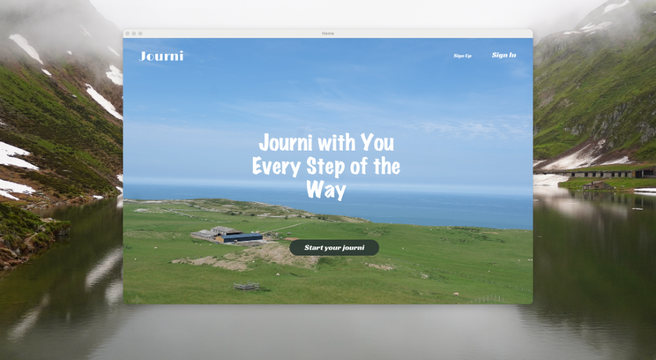
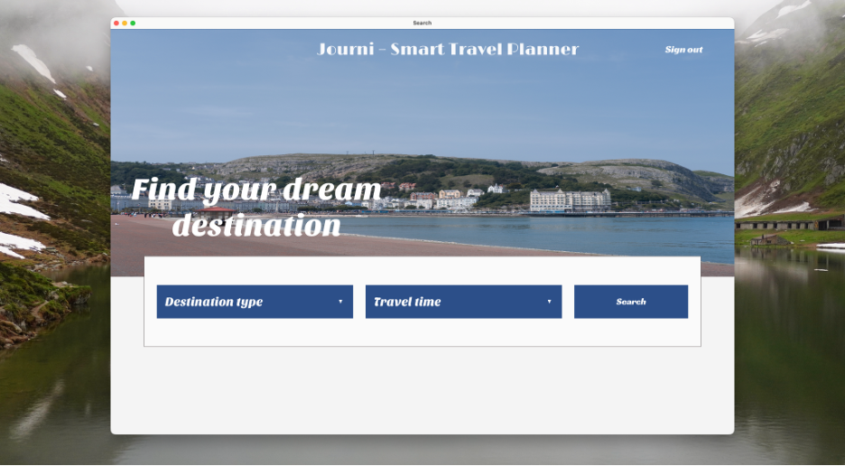
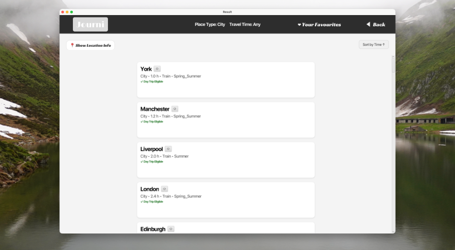
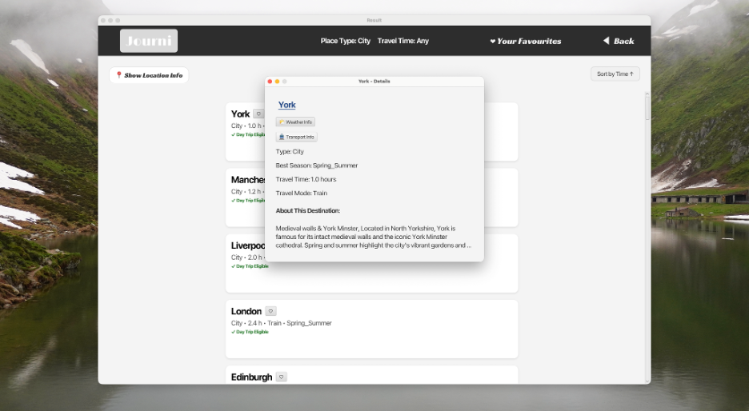
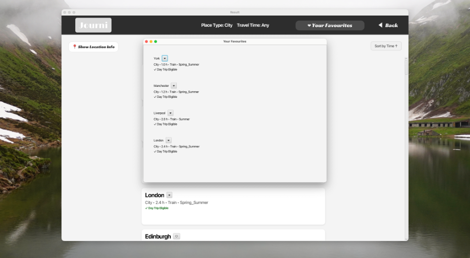

# Journi – Smart Travel Planner

Journi is a **JavaFX desktop application** that helps users discover travel destinations based on their preferences such as **place type** and **travel time**.

The application recommends destinations and presents useful travel information including **travel duration, best season, travel mode, and destination description**, helping users quickly decide where to go when planning a trip.

---

## Key Features

✔ Destination filtering (City, Beach, Mountain)  
✔ Travel time categories (Short, Medium, Long)  
✔ Smart destination recommendations  
✔ User authentication system (Sign Up / Sign In)  
✔ Favourite destinations system  
✔ Detailed destination information view  
✔ Destination sorting by travel time  
✔ Google search integration for weather and transport information

---

## Technologies Used

- **Java 17**
- **JavaFX**
- **Maven build system**
- **Object-Oriented Programming (OOP)**
- **File-based data storage (.txt)**
- **IntelliJ IDEA**

---

## Project Architecture

The application follows a modular architecture separating **GUI, business logic, and data management**.

### GUI & Navigation

- `Home`
- `SignInView`
- `SignUpView`
- `SearchView`
- `ResultView`
- `DetailView`
- `FavouritesView`

### Planner Models

- `Destination`
- `PlaceType`
- `TravelTime`
- `LocationInfo`
- `AbstractLocation`

### Account System

- `Account`
- `AccountRepository`
- `AuthController`

### Utilities

- `DestinationReader`
- `DestinationSorter`
- `FavouritesManager`

---

## Project Structure

```
journi-smart-travel-planner
│
├── screenshots
│   ├── home.png
│   ├── search.png
│   ├── results.png
│   ├── detail.png
│   └── favourites.png
│
├── src/main
│
├── pom.xml
├── README.md
└── LICENSE
```

---

## Application Screenshots

### Home Page



### Search Interface



### Results Page



### Destination Detail



### Favourites System



---

## Running the Application

### Requirements

- Java **17**
- Maven
- IntelliJ IDEA (recommended)

### Run with Maven

```bash
mvn javafx:run
```

or run the main class from IntelliJ:

```
Main.java
```

---

## Future Improvements

- Integrate **real-time weather APIs**
- Add **interactive map integration**
- Replace text file storage with **database (SQLite or PostgreSQL)**
- Improve the **destination recommendation algorithm**
- Package the application as a **desktop installable app**

---

## Author

**Cheng-Yuan King**  
MSc Artificial Intelligence – University of Sheffield
